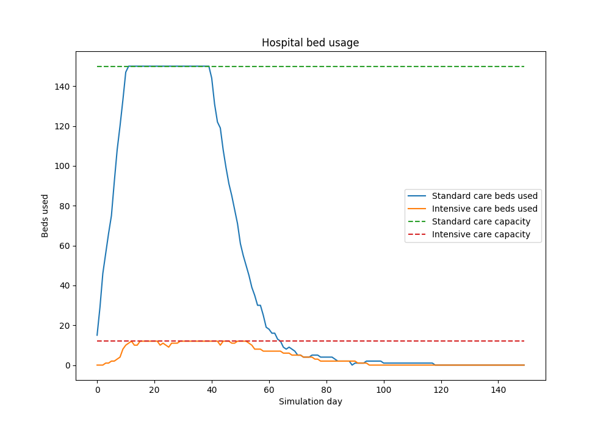

# Discrete simulation - Hospital

- a discrete hospital simulation written in Python 3 using the [Simpy](https://simpy.readthedocs.io/en/latest/) library
- simulates a hospital that takes care of incoming patients (patient number growth follows **poisson distribution**) for a given number of days
    - patient is first transfered to a standard care bed
        - hospitalized for a random number of days (**gaussian distribution**)
            - if there are no available standard care beds then after a certain number of days the patient dies
        - he has a certain chance of death each day there
        - he has a certain chance of requiring intesive care each day there
            - if there are no available intensive care beds then after a certain number of days the patient dies
    - patient can be transfered to an intensive care bed
        - hospitalized for a random number of days (**exponential distribution**)
        - after intensive care treatment is finished the patient returns to the standard care bed
            - if no standard care bed is available, then the patient standard care treatment begins at intensive care bed
## Usage
- the simulation is run by exeuting the `main.py` script
- simulation parameters can be passed via program arguments
    - see help section `python3 main.py --help` 
- or by specifying a configuration file
    - `python3 main.py --config sample_config.json`
    - see the [sample configuration](sample_config.json)
- to have repeating results one can specify the seed by using the `--seed` switch
- to have beds availability stats plotted one pass the  `--plot` switch

